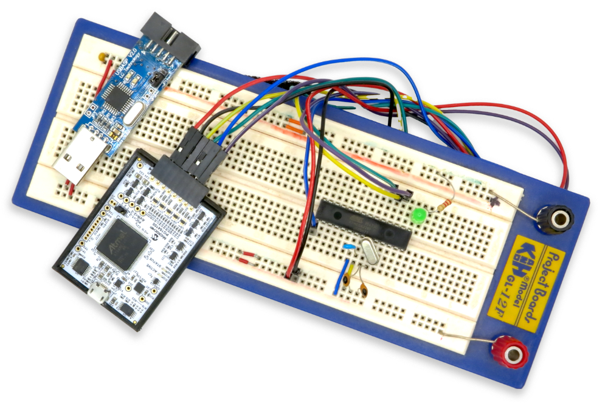

Maker Media GmbH

***

# Fuse-Bits richtig setzen

**Holen Sie alles aus Ihrem AVR-Mikrocontroller heraus und übernehmen Sie die Kontrolle mit Einstellungen, von denen Sie vielleicht noch nie etwas gehört haben: Nutzen Sie einen externen Taktgenerator, schützen Sie Ihr geistiges Eigentum und verhindern Sie Abstürze bei schwankender Spannung.**

Ergänzend zum Artikel in der Make 3/25 gibt es hier die Projektdateien zum Herunterladen.

Den vollständigen Artikel kann man in der **[Make-Ausgabe 3/25](https://www.heise.de/select/make/2025/3)** lesen.
